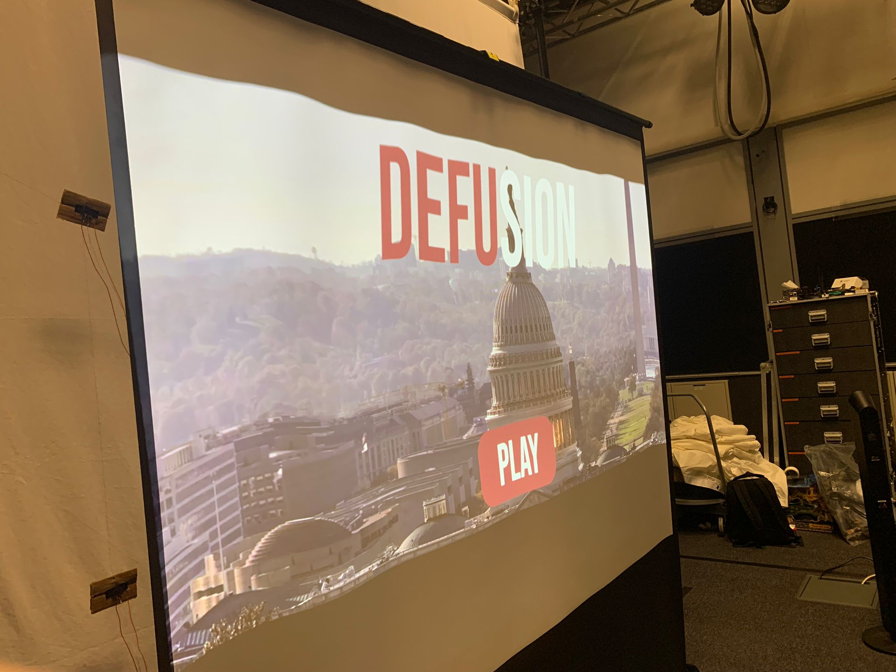

# EGL 315 PROJECT DEFUSION - GROUP C

This **markdown document** will explain the steps necessary to install the required libraries to run the feature's python script, a detailed explanation of the funtions of the code, the reasoning for the theme I selected for the project and my intention on how it would interact with the audience during the End Of Semester showcase.

# Syntax
1. ## Theme
    1. Theme choice
    2. Intention of use
2. ## Research
    1. Benefits of Interactive Features

# Theme

## **Theme choice**
The theme we have chosen for our 315 Module is **Multiplayer Bomb Defusal**, We chose this theme as we want to give our players a thrilling experience as they try to defuse a bomb within 20 or 30 seconds while also making it competitive between 2 humans.

## **Intention of use**
We intend to give our users/players a memorable, immersive, competitive and interactive multiplayer experience that will require them to click buttons according to a sequence to make it our "alive".

## **Hardware Used**
- Raspberry Pi
    ~ Used to control the buttons and ir sensors

- Speakers
    ~ 6 speakers surrounding the audience to provide them clear and surround sound
- Lighting
    ~

  ## Software used
- Christie's Pandora Box
    ~ Used for all the content shown from projector
    ~ Communicates with the rest of the elements (Widget Designer and Raspberry Pi)
    ~ Raspberry Pi and Pandora communicate by python code, this code tells the devices which cue to jump to
- Widget Designer
    ~ used to send command to pandora box, eg (jump to cue,jump to specific sequence,play/pause video)
- Grandma 3
    ~ Used to control lightings and lighting cue lists
- VNC Viewer
    ~ Used to access Raspberry Pis on the laptop
- Christie's Server Management
    ~ Used to show pandora box's content to the projector
  

## IP Address

Laptop C2: 192.168.254.130

Laptop C1: 192.168.254.13

Media Server: 192.168.254.36

Raspberry Pi 1: 192.168.254.101

Raspberry Pi 2: 192.168.254.102

# Research

## Benefits of Interactive Features
- Immersive Experience: The combination of lights, surround sound, and high-quality video creates an immersive experience for the audience.
- Enhanced Engagement: The use of lights, surround sound, and good video can enhance engagement by capturing and holding the attention of the viewers
- Memorable Experience: The combination of lights, surround sound, and good video can create a memorable experience that stays with the viewers long after the project is over.

## System Diagram
## Control

## Video

## Audio

## Lighting

## Floor Plan

[source](https://www.raspberrypi.com/products/raspberry-pi-4-model-b/)

## StoryBoard

## Setup
Game Setup

Projector Setup

Display Screen

## Christie Pandora Box Information

## Widget Designer Information

## grandma3 Information

insert osc in and out page, network page and main page

## BOM List

- item 10, cost is $7290

## Code

    import RPi.GPIO as GPIO
    import time
    import socket
    import subprocess
    
    
    TCP_IP = '192.168.254.11'
    TCP_PORT = 5612
    BUFFER_SIZE = 1024
    MESSAGE = b'Easy'
    MESSAGE2 = b'0'
    MESSAGE3 = b'Correct'
    MESSAGE4 = b'Wrong'
    MESSAGE5 = b'correct'
    GPIO.setmode(GPIO.BCM)
    GPIO.setwarnings(False)
    GPIO.setup(22,GPIO.IN)
    GPIO.setup(24,GPIO.IN)
    GPIO.setup(5,GPIO.IN)
    GPIO.setup(6,GPIO.IN)
    GPIO_TRIGGER = 20
    GPIO_ECHO = 21
    GPIO.setup(GPIO_TRIGGER, GPIO.OUT)
    GPIO.setup(GPIO_ECHO, GPIO.IN)

    def distance():
    GPIO.output(GPIO_TRIGGER, True)
    time.sleep(0.00001)
    GPIO.output(GPIO_TRIGGER, False)
    StartTime = time.time()
    StopTime = time.time()
    while GPIO.input(GPIO_ECHO) == 0:
        StartTime = time.time()
    while GPIO.input(GPIO_ECHO) == 1:
        StopTime = time.time()
    TimeElapsed = StopTime - StartTime
    distance = (TimeElapsed * 34300) / 2

    return distance

    count = 0

    s=socket.socket(socket.AF_INET,socket.SOCK_STREAM)
    s.connect((TCP_IP,TCP_PORT))
    
    subprocess.run(["python","static.py"])
    
    count = 0
    
    
    while True:
    
    if GPIO.input(24):
        count = count +1
        print (count)
        time.sleep(1)
        if count == 1:
            s.send(MESSAGE4)
            subprocess.run(["python","rightred.py"])
            time.sleep(1)
            subprocess.run(["python","rightred.py"])
            s.send(MESSAGE2)
            time.sleep(1)
        elif count == 2:
            s.send(MESSAGE4)
            subprocess.run(["python","rightred.py"])
            time.sleep(1)
            subprocess.run(["python","rightred.py"])
            s.send(MESSAGE2)
            time.sleep(1)
        else:
            s.send(MESSAGE3)
            subprocess.run(["python","Seq1LrRg.py"])
            time.sleep(1)
            subprocess.run(["python","Seq1LrRg.py"])
            s.send(MESSAGE2)
            time.sleep(1)    
        
    elif GPIO.input(5):
        count = count +1
        print (count)
        time.sleep(1)
        if count == 1:        
            s.send(MESSAGE5)
            
            subprocess.run(["python","Seq1LrRg.py"])
            time.sleep(1)
            subprocess.run(["python","Seq1LrRg.py"])
            s.send(MESSAGE2)
            time.sleep(1)
        else:
            s.send(MESSAGE4)
            subprocess.run(["python","rightred.py"])
            time.sleep(1)
            subprocess.run(["python","rightred.py"])
            s.send(MESSAGE2)
            time.sleep(1)
        
        
        
    elif GPIO.input(6):
        count = count + 1
        print (count)
        time.sleep(1)
        if count == 1:
            s.send(MESSAGE4)
            subprocess.run(["python","rightred.py"])
            time.sleep(1)
            subprocess.run(["python","rightred.py"])
            s.send(MESSAGE2)
            time.sleep(1) 
        elif count == 2:
            s.send(MESSAGE5)
            subprocess.run(["python","Seq1LrRg.py"])
            time.sleep(1)
            subprocess.run(["python","Seq1LrRg.py"])
            s.send(MESSAGE2)
            time.sleep(1)
        elif count == 3:
            s.send(MESSAGE4)
            subprocess.run(["python","rightred.py"])
            time.sleep(1)
            subprocess.run(["python","rightred.py"])
            s.send(MESSAGE2)
            time.sleep(1)
        
            

    #start of the game put timer bomb and static light shit here
    elif GPIO.input(22):
        print("start")
        subprocess.run(["python","static.py"])
        subprocess.Popen(["python", "timer.py"])
        s.send(MESSAGE)
        time.sleep(1)
        s.send(MESSAGE2)
        subprocess.run(["python","static.py"])
        time.sleep(1)
        

            
            
    elif __name__ == '__main__':
        try:
            dist = distance()
            if dist  >= 1 and dist <= 10:
                print ("Measured Distance = %.1f cm" % dist)
                time.sleep(1)
                subprocess.run(["python", "Clue1.py"])
                
                
            elif dist >= 10 and dist <= 30:
                subprocess.run(["python", "yamaha.py"])
                              
        except KeyboardInterrupt:
            print("gg")
           

## OSC setup on grandMA3

## References
Starting screen, tutorial,winner video,game over video and credits - Adobe Premiere Pro

Bomb Timer - https://www.youtube.com/watch?v=OYrTQsi1NtE

explosion effect - https://www.pexels.com/search/videos/explosion/

https://www.youtube.com/watch?v=_ttHanoHTL4 - explosion sound

 
